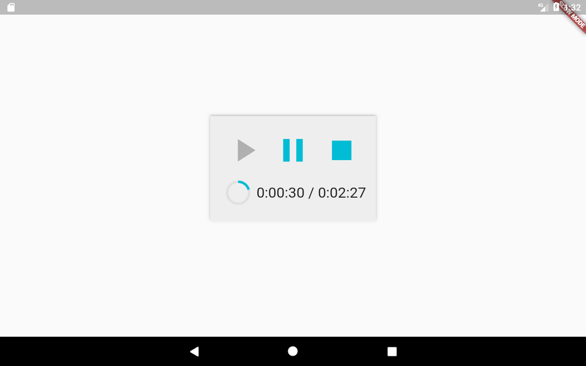

# AudioPlayer

A Flutter audio plugin. 
 
## Features
 
- [x] Android & iOS
  - [x] play (remote file)
  - [x] stop
  - [x] pause
  - [x] onComplete
  - [x] onDuration / onCurrentPosition



## Usage

[Example](https://github.com/rxlabz/flutter_audio/blob/master/example/lib/main.dart) 

To use this plugin : 

- add the dependency to your [pubspec.yaml](https://github.com/rxlabz/flutter_audio/blob/master/example/pubspec.yaml) file. This plugin is not yet published on pub.dartlang,
 so the dependency must be added with a local path.

```yaml
  dependencies:
    flutter:
      sdk: flutter
    flutter_audiostream:
      path: /absolute/or/relative/path/flutter_audiostream
```

- instantiate a FlutterAudiostream instance

```dart
//...
FlutterAudiostream audioPlugin = new FlutterAudiostream();
//...
```

### play, pause , stop

```dart
Future play() async {
  final result = await audioPlayer.play(kUrl);
  if (result == 1) setState(() => playerState = PlayerState.playing);
}
  
Future pause() async {
  final result = await audioPlayer.pause();
  if (result == 1) setState(() => playerState = PlayerState.paused);
}

Future stop() async {
  final result = await audioPlayer.stop();
  if (result == 1)
    setState(() {
    playerState = PlayerState.stopped;
    position = new Duration();
  });
}

```

### duration, position, complete, error (temporary api) 

The dart part of the plugin listen for platform calls :

```dart
//...
audioPlayer.setDurationHandler((d) => setState(() {
  duration = d;
}));

audioPlayer.setPositionHandler((p) => setState(() {
  position = p;
}));

audioPlayer.setCompletionHandler(() {
  onComplete();
  setState(() {
    position = duration;
  });
});

audioPlayer.setErrorHandler((msg) {
  print('audioPlayer error : $msg');
  setState(() {
    playerState = PlayerState.stopped;
    duration = new Duration(seconds: 0);
    position = new Duration(seconds: 0);
  });
});
```

## iOS
   
### :warning: Swift project only

As the iOS part of the plugin is written in Swift, you can, for now, 
only use it within a [swift xcode project](https://flutter.io/platform-channels/#step-3c-add-an-ios-platform-specific-implementation-using-swift), 
with a PluginRegistry.swift (not .h and .m).

### :warning: Http url

If you want to allow file from non https server you need to add this to your info.plist

```xml
<key>NSAppTransportSecurity</key>
<dict>
    <key>NSAllowsArbitraryLoads</key>
    <true/>
</dict>
```

## Getting Started

For help getting started with Flutter, view our online
[documentation](http://flutter.io/).

For help on editing plugin code, view the [documentation](https://flutter.io/platform-plugins/#edit-code).